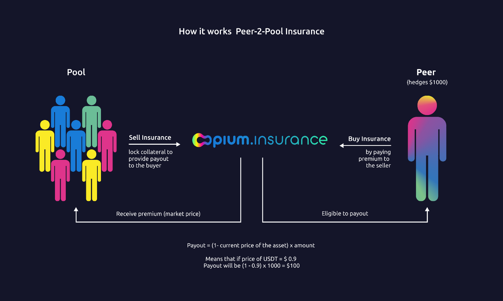

# Intro

Derivatives on Opium Protocol are “peer 2 peer” and require 2 counterparts to settle a deal.

https://docs.opium.network/introduction-to-opium/what-is-opium

[[./images/opium-protocol.png|width=100px]]

Finding these counterparts is a problem and requires orderbooks to find and match traders with opposite desires. Traders need to actively maintain their orders and their prices though.

Opium.Finance pools are solving these problems by “pooling” one counterparty (SHORT / Selling) side together. Traders are staking their funds into the pool and all agree on the same derivative params and price (premium) for selling it. (Params are defined either automatically or by DAO / Pool Advisor)

Another counterparty (LONG / Buying) is purchasing the defined derivative from the pool, by paying it the premium.

https://medium.com/opium-network/introducing-opium-insurance-231bacdac44

# Phases explained

Opium.Finance pools have a lifecycle called ”**Epoch**”. Epochs usually last 1 week, from and until each Friday 8:00 UTC. Each epoch is separated into 3 phases: **Staking**, **Trading** and **Idle**.
The Staking phase is sometimes called a “Rebalancing” phase. Lengths of the phases differ from pool to pool, but usually are: Staking (4h), Trading (48h), Idle (116h).

Pool has some features enabled / disabled depending on the current phase.

| Phase                 | Pool features enabled       | Peer features enabled |
|-----------------------|-----------------------------|-----------------------|
| STAKING (Rebalancing) | Direct deposit / withdrawal | -                     |
| TRADING               | Direct deposit              | Purchasing            |
| IDLE                  | -                           | -                     |

# Staking mechanics

Staking into the pools is performed by locking the collateral in the pool and receiving LP (pool share) tokens.

Since direct deposit into the pool is only available during the small length of Staking and Trading phases and direct withdrawals from pools are only available during the small length of the Staking phase, it’s not easy for users to deposit and withdraw in time.

That’s why pools have additional smart contract helpers for indirect (scheduled) Deposits and Withdrawals to improve UX.

**DepositScheduler** - allows users to schedule deposits for the next staking phase. Users lock collateral in the DepositScheduler contract. Once direct deposits are available, any entity or cronjob can call the public function and execute scheduled deposits on the users’ behalf one by one. Locked collateral is being pulled by the pool and acquired LP tokens are transferred directly to the users. Before users’ scheduled deposits are executed, users can **unschedule** them, receiving the collateral back.

**WithdrawalScheduler** - allows users to schedule withdrawal for the next staking phase. Users lock their LP tokens in the WithdrawalScheduler. Once direct withdrawals are available, any entity or cronjob can call the public function and execute scheduled withdrawals on users’ behalf one by one. Locked LP tokens are being redeemed by the pool for the collateral, which is then transferred directly to the users. Before users’ scheduled withdrawal is executed, users can **unschedule** them, returning the LP tokens back.

# Purchasing mechanics

Purchasing from the pool is performed by paying the required premium to the pool, minting the derivative contracts and receiving the appropriate amount of LONG positions of that derivative.

Each LONG position has expiry (maturity) after which it may have the payout, if settled **in-the-money**. If the payout is 0, there is no need to execute it and the position might be just abandoned, if payout is greater than 0, then LONG position can be executed, burnt and the respective payout will be transferred to the position holder.

# Reference staking UI

- Shows current user’s deposit in the pool
- Shows user’s scheduled (pending) deposit to the pool
- Allows to unschedule pending deposit before it was executed and deposited
- Shows user’s scheduled (pending) withdrawal from the pool
- Allows to unschedule pending withdrawal before it was executed and withdrawn
- Input to specify amount for deposits / withdrawals
- Action buttons depending on the currently possible actions
- - Deposit
- - - If current phase is Staking / Trading, then show **direct** “Deposit” button
- - - Otherwise show “Schedule Deposit” button
- - Withdrawal
- - - If current phase is Staking, then show **direct** “Withdraw” button
- - - Otherwise show “Schedule Withdrawal” button

Currently Opium.Finance has the following UI for staking https://app.opium.finance/polygon/staking :

1. Open Staking widget

2. Staking widget

Opium.Finance UI for scheduled and direct deposits and withdrawals is similar. Based on the currently available option UI calls the respective function under the hood. In case of **scheduled** deposits and withdrawals, there is an additional infobox stating the information about what scheduled deposit or withdrawal means.

# Reference purchasing UI

1. Input to specify nominal of the purchase
2. Show the price (premium) that’s required to be paid for the purchase
3. Action button to perform the purchase

Currently Opium.Finance has the following UI for staking https://app.opium.finance/polygon/turbo :

1. Open Purchasing widget

2. Purchasing widget

# Pool analytics and details UI

## Positions

In addition to staking / purchasing UI there is a **Positions** page, which makes the tracking of the staked funds and purchased positions more convenient. Also it includes the helping actions allowing to manipulate with users positions. For example: Trade, Execute

## Pool performance

Pool’s performance can be shown as a chart, where X axis represents each epoch and Y axis has 2 charts: line and bar. Line chart shows total “Return since inception” - performance of the pool, starting from the first epoch. Bar chart shows the increase / decrease of the pool’s performance per each epoch.

Another way of showing the pool’s performance is to show the difference in $ value of the holding of underlying collateral vs collateral staked into the pool.

# Profit & Loss and risk disclosure

It’s important for stakers and buyers to be able to see and understand the risk exposure they are having by using the product. For this reason there might be a P&L chart, showing the profit and loss ratio depending on the possible outcomes.

https://opium.watch/

Also additional description of the strategy would help understanding the financial engineering that’s happening under the hood of the pool. Currently it’s shown on Opium.Finance like this

But Opium.Watch is planning the release of a knowledge base some time soon™